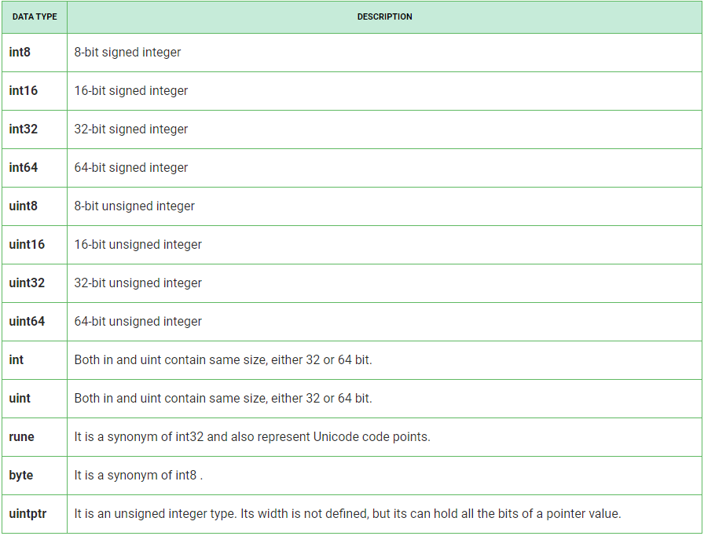

# Understanding Data Types in Go

## Introduction

Welcome to the "Understanding Data Types in Go" repository! This simple Go program explores different data types such as integers, uints, floats, and complex numbers. The program aims to provide a basic understanding of how these data types work in Go.

## Key Concepts

- **Integers and Uints:** Integers represent positive whole numbers without decimals. Uints are unsigned integers.

  - Types: uint, uint8, uint16, uint32, uint64, uintptr

- **Floats:** Floats represent signed decimal numbers.

  - Types: float32, float64

- **Complex Numbers:** Complex numbers are used less frequently.
  - Types: complex64, complex128

## Explanation

The program includes a demonstration of converting a float to an int for illustrative purposes. Here's a summary of the conversion:

- Convert the float value `2.6` to an int using `int64(accountAgeFloat)`.
- Print the result indicating the account's existence in years.

## Running the Program

To run the program, follow these steps:

1. Clone the repository to your local machine.
2. Navigate to the directory containing the Go file (`main.go`).
3. Open a terminal or command prompt in that directory.
4. Run the following command:

`go run typeSize.go`

## Output

Upon running the program, you will see information about the various data types in Go and a specific example highlighting the conversion of a float to an int.

# Choosing Number Types in Go

## Introduction

Welcome to the "Choosing Number Types in Go" documentation! This guide aims to help developers understand the considerations when selecting number types in Go, particularly in situations where multiple types are available for representing numbers.

## Which Type Should I Use?

In Go, there are multiple types available for representing numbers, and choosing the right type can be crucial for code maintainability and performance. Here are some key considerations:

### Prefer "Default" Types

Using non-default types within a type family (e.g., uint16 instead of int) can lead to code cluttered with type conversions. This not only affects readability but can also impact performance. Therefore, it's generally recommended to use the "default" types, such as:

- bool
- string
- int
- uint
- byte
- rune
- float64
- complex128

Straying from these defaults without a valid performance-related reason can lead to messy code and potential performance issues.

### When to Use a More Specific Type

If you have specific concerns about performance and memory usage, opting for a more specific type might be warranted, especially when dealing with resource-constrained applications. However, this should be a deliberate decision driven by performance needs.

### Special Case of uint64

An exceptional scenario for deviating from the defaults is when an application requires an extensive range of unsigned integers, such as uint64. This specialized need justifies the use of a non-default type.

## Additional Resources

For further details on this topic, additional resources are available for deeper exploration. While not mandatory, these resources can provide a more comprehensive understanding of number type selection in Go.

## Author

- Author: [Your Name]

Feel free to experiment with the code, modify it, or extend its functionality to deepen your understanding of data types in Go. If you have any questions or require assistance, feel free to reach out.

Happy coding!
